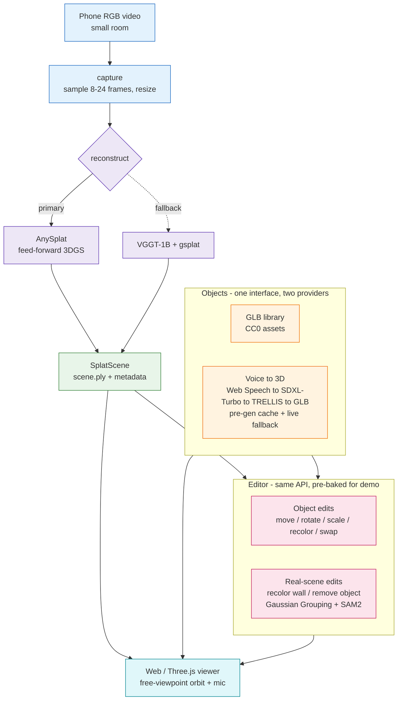

# Splatial

**Scan a room with a phone camera, turn it into an editable 3D Gaussian Splatting scene, and drop in furniture — pre-built or spoken into existence ("make me a chair") — that stays anchored as you move.** Camera-only (no LiDAR), built modular, aimed at AR glasses.

## System design



## Tech & why

| Layer | Choice | Why |
|---|---|---|
| Reconstruction | **AnySplat** (MIT) — feed-forward 3DGS | Camera-only, uncalibrated/unposed RGB → splat + poses in one pass; no SLAM, no calibration. |
| Reconstruction fallback | **VGGT-1B-Commercial → gsplat** (commercial-gated / Apache-2.0) | Commercial-clean backup if AnySplat quality/VRAM disappoints. |
| Viewer | **Three.js + gsplat renderer** | Fastest, most reliable path for the demo; mature web splat renderers, no native build. |
| Voice → 3D | **Web Speech → SDXL-Turbo → TRELLIS** (MIT) | Speech needs no GPU; TRELLIS exports GLB directly and fits 12 GB; all commercial-safe. |
| Real-scene edits | **Gaussian Grouping + SAM 2.1** (Apache-2.0) | Mask-driven select/recolor/remove of Gaussians — edits the real room, not just objects. |

Every "live" moment (generation, real-scene edits) has a **pre-baked artifact** behind a cache, so the demo is deterministic; the genuine pipeline runs behind it.

## Why this is the right bet for AR glasses

Glasses have **cameras but no LiDAR** — exactly the constraint Splatial is built around, so camera-only reconstruction ports directly to the target hardware instead of being thrown away. The reconstruction core is **platform-agnostic Python** that moves to Meta Quest / OpenXR with on-device VIO and offloaded inference, and the **anchoring, object, and editing layers are reused unchanged** — the phone demo is the first rung, not a detour.

## Limitations

- **Feed-forward splat quality** trails per-scene optimization; mitigated by an optional gsplat post-optimization pass on the hero scene.
- **Up-to-scale, not metric** out of the box — metric needs a known reference or ARKit poses via a single Sim(3) alignment.
- **12 GB VRAM (RTX 4070 Ti)** caps view count (~8–24) and resolution (≤448px); larger scans go to a cloud GPU.
- **Live generation latency** (~30–40s) and **static-scene assumption** (minor motion ghosts) — the pre-gen cache hides latency on stage; scenes are assumed mostly static.

## Repository layout (planned)

```
docs/            Design spec + per-module API docs
modules/
  capture/       Phone video -> frames
  reconstruct/   Frames -> SplatScene (.ply + metadata)   [AnySplat | VGGT fallback]
  scene_store/   Persist splats, placed objects, edit ops
  generate/      Voice/text -> GLB  [Web Speech -> SDXL-Turbo -> TRELLIS] + cache
  objects/       Acquire (library | generated) + place/transform GLB in splat frame
  editor/        Edit ops: objects + real-scene splat variants
  viewer/        Render splat + objects (free-viewpoint, mic button)
assets/          Pre-built GLB library + pre-generated cache
```

Full design: [`docs/superpowers/specs/2026-06-01-ar-scan-edit-design.md`](docs/superpowers/specs/2026-06-01-ar-scan-edit-design.md). Foundation plan: [`docs/superpowers/plans/2026-06-01-splatial-foundation.md`](docs/superpowers/plans/2026-06-01-splatial-foundation.md). Setup lives in each module's README.
