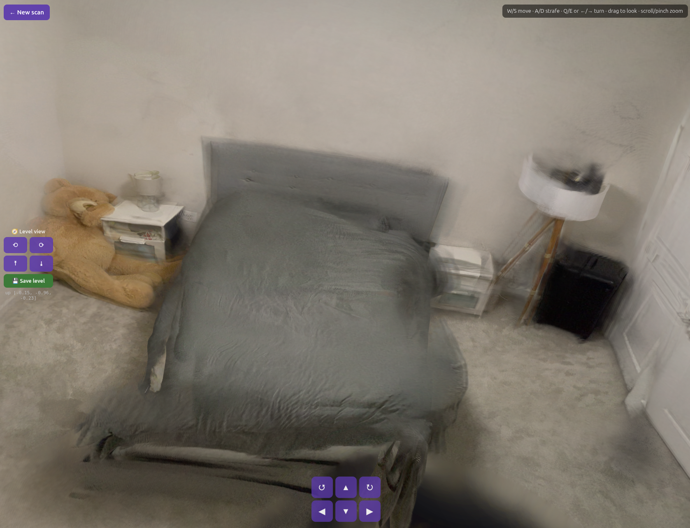
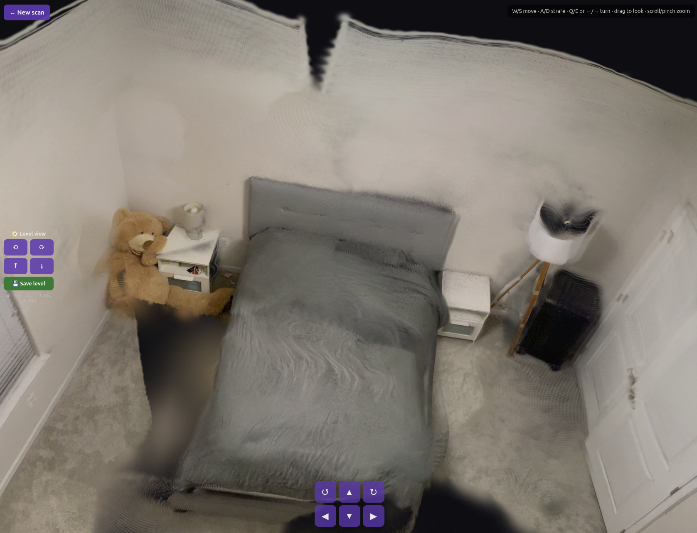

# Splatial

**Scan a small room with a phone camera (no LiDAR), reconstruct it as a 3D Gaussian Splatting scene with AnySplat, and explore it free-viewpoint in a web / Three.js viewer.** Camera-only and built modular — and because the reconstruction core needs only cameras, it ports to AR glasses, which have cameras but no LiDAR.

## Results

The same bedroom capture, reconstructed two ways. **Only the input view count differs** — same AnySplat model, same footage.

| Best result — 48 views (cloud A100) | Our GPU — 16 views (local RTX 4070 Ti) |
|---|---|
|  |  |
| 48 views fit in an 80 GB cloud GPU. Surfaces (bed, walls, floor) are smoother and floaters are minimal — more views constrain the geometry. | Same room and footage at the 12 GB local cap of 16 views. The room still reads clearly, but sparse coverage leaves **black floater-smear** on the ceiling and floor. |

> The cloud GPU's real unlock was **fitting more views in memory**, not more compute. AnySplat is feed-forward — one pass through frozen weights — so a bigger GPU buys view count and capacity, not a better optimum. (Per-scene optimization to "sharpen" further *hurts* free-orbit realism; see [Limitations](#limitations).)

## What's built today

```
capture ──frames──▶ reconstruct ──SplatScene──▶ scene_store ──▶ viewer
 (sample,            (AnySplat                   (scene.ply +     (Three.js
  resize)             feed-forward 3DGS)          scene.json)      free-orbit + walk)
```

- **capture** — phone video → ordered, de-blurred frames.
- **reconstruct** — frames → `SplatScene` (`scene.ply` + metadata) via AnySplat (MIT), one `Reconstructor` interface (VGGT+gsplat fallback wired).
- **scene_store** — persist/load the scene folder (`scene.ply`, `scene.json`).
- **viewer** — web / Three.js free-viewpoint orbit + first-person walk.

## Tech & why

| Layer | Choice | Why |
|---|---|---|
| Reconstruction | **AnySplat** (MIT) — feed-forward 3DGS | Camera-only, uncalibrated/unposed RGB → splats + poses in one pass; no SLAM, no calibration. |
| Reconstruction fallback | **VGGT-1B-Commercial → gsplat** (Apache-2.0) | Commercial-clean backup if AnySplat quality/VRAM disappoints. |
| Viewer | **Three.js + gsplat renderer** | Mature web splat renderer, no native build — the reliable path for a demo. |

## Why this is the right bet for AR glasses

Glasses have **cameras but no LiDAR** — exactly the constraint Splatial is built around, so camera-only reconstruction ports to the target hardware instead of being thrown away. The reconstruction core is **platform-agnostic Python** that moves to Meta Quest / OpenXR with on-device VIO and offloaded inference; the phone + web viewer are the first rung, not a detour.

## Limitations

- **View count is the quality lever, and it's VRAM-bound.** 12 GB (RTX 4070 Ti) caps feed-forward at **16 views** at the 448×616 crop; denser/sharper needs a cloud GPU (the A/B above). An OOM-recovery ladder (16→12→10→8) degrades gracefully.
- **Feed-forward wins free-orbit; per-scene post-opt is a dead end here.** Post-opt raises *on-trajectory* held-out PSNR (22.6→28.5) but adds "needle" + speckle artifacts from every orbit angle — it overfits the capture path. Realism is judged by a free-orbit screenshot dome (`web/tools/orbit-shots.mjs`), never interpolation PSNR. Root cause: [`docs/analysis/2026-06-04-postopt-vs-feedforward-rootcause.md`](docs/analysis/2026-06-04-postopt-vs-feedforward-rootcause.md).
- **Background haze on object scans** — orbiting a subject under-observes the background, so AnySplat fills it with translucent guessed-depth splats. Fix is capture-side (plain background / tight framing), not post-filtering.
- **Up-to-scale, not metric** — metric needs a known reference or ARKit poses (one Sim(3) alignment).

## What could make it better

1. **A bigger GPU** (cloud A10/L40S/A100) — the main unlock: lifts the 16-view cap to 30–200, where surfaces get dense. *More views, not more optimization.*
2. **Better capture** — matte subject, even light (kill glare), a textured/static background, and a real orbit with parallax. The biggest lever the code can't supply.
3. **Appearance** — enable SH degree 1–2 for view-dependent shine on a hero scene (currently SH0).

> Full bug/quality analysis: [`docs/debugging/`](docs/debugging/). Data flow + math: [`docs/DATA_FLOW.md`](docs/DATA_FLOW.md).

## How to run

```bash
python3 -m venv .venv && . .venv/bin/activate
pip install -e ".[dev]" && pytest                    # capture + scene_store + reconstruct smoke

# Reconstruct a room: video → scene folder (AnySplat runs in the `anysplat` conda env)
python -m modules.reconstruct.cli <video> scenes <id>

cd web && npm install && npm run dev                 # dev viewer at http://localhost:5173/view/?scene=<id>
```

## Run on your phone (Docker)

Reconstruct and view from a phone with **one command** on any Linux machine with an NVIDIA GPU — capture page, viewer, and reconstruction all served from one container on one port.

**One-time host setup:** install [Docker](https://docs.docker.com/engine/install/), the NVIDIA driver, and the [NVIDIA Container Toolkit](https://docs.nvidia.com/datacenter/cloud-native/container-toolkit/latest/install-guide.html).

**Step 1 — start it (prints a URL + QR):**
```bash
docker run --gpus all --network host -v "$PWD/scenes:/app/scenes" ghcr.io/xji6xu4m3/splatial
```

**Step 2 — on your phone (same Wi-Fi):** scan the QR or open the printed `http://<host-ip>:8080`, record a room with your Camera app, upload it → it reconstructs (~1–2 min) → tap to view in 3D.

The view cap **auto-scales to your GPU's VRAM** (≤12 GB → 16 views, 16–24 GB → 32, ≥40 GB → 48); override with `-e MAX_VIEWS=24`. NVIDIA only (driver ≥ 525 for CUDA 12.1); scans persist on the host via the mounted `scenes/` volume.

## Repository layout

```
docs/            Design spec + analysis (img/ holds the result screenshots)
modules/
  capture/       Phone video -> frames                         [built]
  reconstruct/   Frames -> SplatScene (.ply + metadata)        [built: AnySplat | VGGT fallback]
  scene_store/   Persist scene folder + data contracts         [built]
  viewer/        Render splat (free-orbit + walk)              [built]
scenes/<id>/     scene.ply + scene.json   (gitignored)
```

### Hardware & the ceiling it sets

| | |
|---|---|
| **Dev GPU** | NVIDIA **RTX 4070 Ti, 12 GB** (the demo machine) |
| **Feed-forward view cap** | **16 views** at the default 448×616 tall crop (20 OOMs in voxelization) |
| **Model input** | **448 short side, long side ≤ 616** (multiple of the ViT patch 14) — recovers portrait FOV |
| **Cloud fallback** | same CLI runs on A10/L4/A100 — the only path to 30–200 views |

### Key parameters

| Parameter | Default | Why |
|---|---|---|
| `MAX_VIEWS` / `MIN_VIEWS` | **16 / 16** | The 12 GB ceiling at the 616 crop; OOM ladder auto-drops 16→12→10→8. |
| `CROP_LONG_CAP` | **616** | Tall portrait crop (keep 448 short side, crop long side to 616) recovers ~38% vertical FOV vs a hard 448² square. MIT-clean replacement for AnySplat's CC-BY-NC `process_image`. |
| `SCENE_MODE` | **room** | `object` adds floater cleanup (outlier removal, higher opacity floor) for subject-on-background scans; `room` preserves low-density walls. |
| `CAPTURE_RATE` | **1.5 /s** | Blur-aware fixed-rate sampling, clamped to the view cap. |
| opacity encoding | **logit on export** | Viewer applies `sigmoid` on load; storing the logit keeps the `.ply` standard-conformant (else everything renders hazy). |
| SH degree | **0** (DC only) | Smaller/faster PLYs; a fidelity ceiling, not a geometry limit. |

Tune via env, e.g. `SCENE_MODE=object CROP_LONG_CAP=616 python -m modules.reconstruct.cli <video> scenes <id>`. Quality is tracked with a held-out-view PSNR/SSIM/LPIPS harness (`experiments/eval_heldout.py`) plus the free-orbit dome.

---

Full design: [`docs/superpowers/specs/2026-06-01-ar-scan-edit-design.md`](docs/superpowers/specs/2026-06-01-ar-scan-edit-design.md) · Foundation plan: [`docs/superpowers/plans/2026-06-01-splatial-foundation.md`](docs/superpowers/plans/2026-06-01-splatial-foundation.md).
