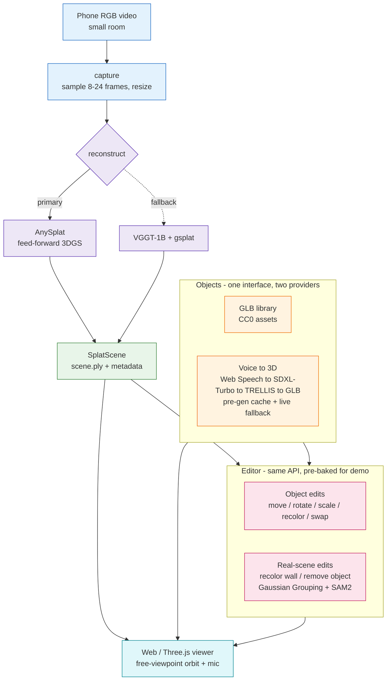

# Splatial

**Scan a room with a phone camera, turn it into an editable 3D Gaussian Splatting scene, and drop in furniture — pre-built or spoken into existence ("make me a chair") — that stays anchored as you move.** Camera-only (no LiDAR), built modular, aimed at AR glasses.

## System design



## Tech & why

| Layer | Choice | Why |
|---|---|---|
| Reconstruction | **AnySplat** (MIT) — feed-forward 3DGS | Camera-only, uncalibrated/unposed RGB → splat + poses in one pass; no SLAM, no calibration. |
| Reconstruction fallback | **VGGT-1B-Commercial → gsplat** (commercial-gated / Apache-2.0) | Commercial-clean backup if AnySplat quality/VRAM disappoints. |
| Viewer | **Three.js + gsplat renderer** | Fastest, most reliable path for the demo; mature web splat renderers, no native build. |
| Voice → 3D | **Web Speech → SDXL-Turbo → TRELLIS** (MIT) | Speech needs no GPU; TRELLIS exports GLB directly and fits 12 GB; all commercial-safe. |
| Real-scene edits | **Gaussian Grouping + SAM 2.1** (Apache-2.0) | Mask-driven select/recolor/remove of Gaussians — edits the real room, not just objects. |

Every "live" moment (generation, real-scene edits) has a **pre-baked artifact** behind a cache, so the demo is deterministic; the genuine pipeline runs behind it.

## Why this is the right bet for AR glasses

Glasses have **cameras but no LiDAR** — exactly the constraint Splatial is built around, so camera-only reconstruction ports directly to the target hardware instead of being thrown away. The reconstruction core is **platform-agnostic Python** that moves to Meta Quest / OpenXR with on-device VIO and offloaded inference, and the **anchoring, object, and editing layers are reused unchanged** — the phone demo is the first rung, not a detour.

## Limitations

- **Feed-forward splat quality** trails per-scene optimization; a gsplat post-opt pass helps **only with many overlapping views** (≤8 views overfits into spiky artifacts), so it's gated, not default.
- **Up-to-scale, not metric** out of the box — metric needs a known reference or ARKit poses via a single Sim(3) alignment.
- **12 GB VRAM (RTX 4070 Ti)** caps feed-forward at **~20 views** (24 OOMs) and input at 448²; denser/sharper needs a cloud GPU.
- **Live generation latency** (~30–40s) and **static-scene assumption** (minor motion ghosts) — the pre-gen cache hides latency on stage; scenes are assumed mostly static.

> Full verified bug/quality analysis: [`docs/debugging/`](docs/debugging/). Data flow + math: [`docs/DATA_FLOW.md`](docs/DATA_FLOW.md).

## Repository layout (planned)

```
docs/            Design spec + per-module API docs
modules/
  capture/       Phone video -> frames
  reconstruct/   Frames -> SplatScene (.ply + metadata)   [AnySplat | VGGT fallback]
  scene_store/   Persist splats, placed objects, edit ops
  generate/      Voice/text -> GLB  [Web Speech -> SDXL-Turbo -> TRELLIS] + cache
  objects/       Acquire (library | generated) + place/transform GLB in splat frame
  editor/        Edit ops: objects + real-scene splat variants
  viewer/        Render splat + objects (free-viewpoint, mic button)
assets/          Pre-built GLB library + pre-generated cache
```

Full design: [`docs/superpowers/specs/2026-06-01-ar-scan-edit-design.md`](docs/superpowers/specs/2026-06-01-ar-scan-edit-design.md). Foundation plan: [`docs/superpowers/plans/2026-06-01-splatial-foundation.md`](docs/superpowers/plans/2026-06-01-splatial-foundation.md). Setup lives in each module's README.

---

## Technical reference (current build)

<details>
<summary>▶️ <b>Demo video</b> (coming soon — placeholder)</summary>

<!-- Drop the demo clip here, e.g.:
https://github.com/<user>/<repo>/assets/<id>/demo.mp4
or an embedded thumbnail linking to the video. -->
*A short capture → reconstruct → walk-through → edit demo will go here.*
</details>

### Hardware & the ceiling it sets

| | |
|---|---|
| **Dev GPU** | NVIDIA **RTX 4070 Ti, 12 GB** (the demo machine) |
| **Feed-forward view cap** | **20 views** verified to fit; **24 OOMs** at AnySplat's voxelization step |
| **Post-opt view cap** | **~8 views** (gradients + encoder graph are heavier) |
| **Model input** | fixed **448×448** (AnySplat's DINOv2 grid) — bigger frames only help by being *downsampled* sharp |
| **Capture device** | phone (any RGB video); native `/dev/video0` for bench tests |
| **Cloud fallback** | same CLI runs on A10/L4/A100 — the only path to 30–200 views |

### Parameters & why

| Parameter | Default | Why this value |
|---|---|---|
| `MAX_VIEWS` / `MIN_VIEWS` | **20 / 16** | Push the 12 GB ceiling — 20 fits, 24 OOMs. Floor of 16 keeps short clips well-covered. |
| `CAPTURE_RATE` | **1.5 /s** | Blur-aware **fixed-rate** sampling (AnySplat's demo uses ~1 fps); 1.5 fills toward the cap on a ~15 s clip. Window = `duration/N`, so the interval is dynamic. |
| `CAPTURE_LONG_SIDE` | **0 (native)** | Feed native frames so AnySplat's `process_image` *downsamples* sharp pixels instead of upscaling a blurry 252-line image (Bug 4). |
| opacity encoding | **logit on export** | The web viewer applies `sigmoid` on load; AnySplat emits linear `[0,1]`. Storing the logit makes the `.ply` standard-conformant (else everything renders at 50–73 % haze). |
| `MAX_GAUSSIANS` (mobile) | **1.1 M** (uniform prune) | Phones can't load multi-million-splat PLYs; uniform subsample thins evenly and keeps the background. Desktop can serve the full PLY. |
| SH degree | **0** (DC only) | Smaller/faster PLYs; a fidelity ceiling, not a geometry limit. Optional deg-1 for view-dependent shine later. |
| scene `up` | **from camera poses** | `up = −mean(predicted camera Y axes)` (Nerfstudio method) → floor renders level; RANSAC floor-plane fallback; hand-tunable in `scene.json`. |
| viewer pixel ratio | **≤1.25** | Phones render at 2–3×; capping cuts GPU heat ~4–6× with little visible loss. |

Tune any of these via env, e.g. `MAX_VIEWS=24 CAPTURE_RATE=2 python -m modules.reconstruct.cli <video> scenes <id>`.

### How we'd optimize next

1. **Bigger GPU (the main unlock).** A cloud A100/L40S (40–80 GB) lifts the 20-view cap to 30–200, which is where surfaces get dense *and* where post-optimization starts to **help** instead of overfitting to spiky "needle" artifacts.
2. **Capture quality.** Matte subject, even light (kill RGB/monitor glare), a static **textured** (or masked) background, and a real orbit with parallax — the biggest lever the code can't supply.
3. **Sampler v2.** Optical-flow **motion-aware** keyframing (constant parallax) on top of today's blur-aware fixed-rate.
4. **Appearance.** Enable SH degree 1–2 for view-dependent shading on the hero scene.
5. **Metric scale & robust up.** A one-shot Sim(3) to ARKit/known-reference for metric units; up-recovery is strongest on room pans (tight object orbits pitch the phone — fall back to the manual `up`).
6. **Editing phases (next).** Object edit ops → voice→3D (TRELLIS) → real-scene edits (Gaussian Grouping + SAM 2) — all behind the same data contracts.
