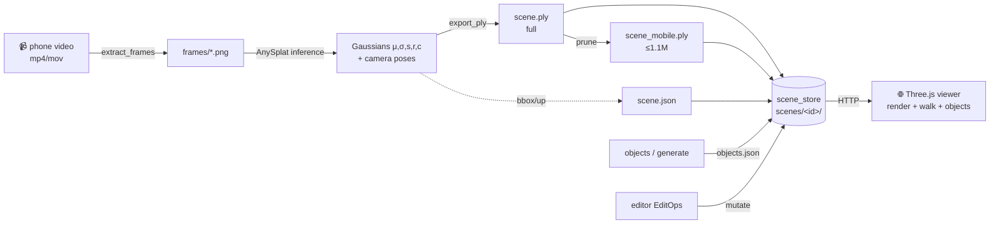
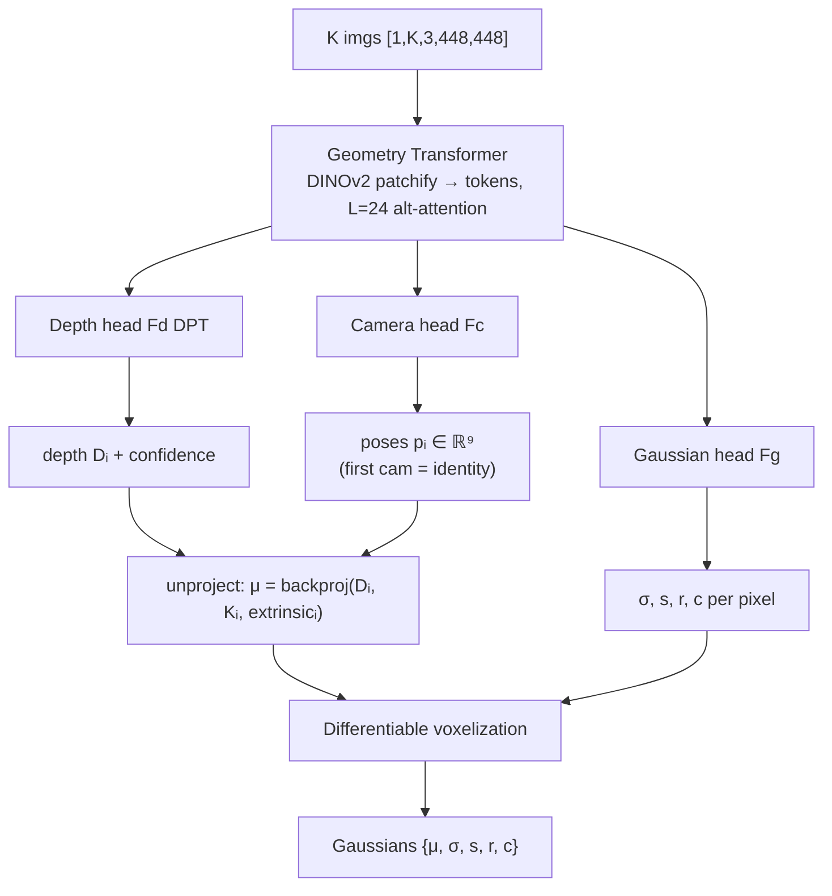

# Splatial — data flow & math (developer big-picture)

How a phone video becomes an editable splat scene in the browser: what each module
**receives**, **outputs**, the **transforms/augmentation** it applies, and the **math** of each
stage. Read this to get the whole pipeline in one sitting. Contracts live in
`modules/scene_store/contracts.py`; this doc is the narrative + math around them.

## 0. Pipeline at a glance

Scene folder = the unit of exchange: `scenes/<id>/{scene.ply, scene_mobile.ply, scene.json, objects.json, frames/}`.

## 1. `capture` — video → frames

| | |
|---|---|
| **Receives** | a video file path (`data/<id>.mov`, e.g. 1920×1080 @30fps, ~15 s) |
| **Outputs** | `scenes/<id>/frames/frame_####.png` — `N` frames, `N=clamp(round(duration·rate),MIN,MAX)` |
| **Augment / transform** | **blur-aware fixed-rate** keyframing + optional resize |

**Math.** Target a fixed **rate** (≈1 view/sec), so view count scales with length, clamped to
`[MIN_VIEWS, MAX_VIEWS]`: `N = clamp(round((total/fps)·rate), MIN, MAX)`. Split `[0,total)` into `N`
equal windows; in each, keep the frame with the highest **focus measure**
`f = Var(∇²I)` (variance of the Laplacian) → drops motion blur, even windows ⇒ even angular spacing.
Resize keeps aspect (`scale = long_side/max(h,w)`); **`long_side ≤ 0` ⇒ native** (model resizes
internally, §2). Pure helpers are TDD-tested (`modules/capture/tests`).

> **Bug 4 (fixed):** pre-shrinking to `long_side=448` produced 448×252 frames that the model
> then *upscaled* back to 448 (blurry). Default is now native; the model downsamples sharp pixels.

## 2. `reconstruct` — frames → Gaussians (AnySplat, feed-forward)

| | |
|---|---|
| **Receives** | list of frame paths (capped to `max_views`) |
| **Outputs** | `SplatScene` + `scene.ply` (and predicted camera poses, currently dropped) |
| **Augment / transform** | per-image normalize + resize-to-square; the model does the rest in one forward pass |

### 2a. Preprocess (`process_image`)
Each image: resize the **short** side to 448, **center-crop to 448×448** (keeps central ~56% of a
16:9 frame), `ToTensor()` then `·2−1` → range **[−1, 1]**. The adapter then maps to **[0, 1]** via
`(x+1)·0.5` before `model.inference`. The model **only ever sees 448×448** — its DINOv2 patch grid
and positional encodings are fixed at that resolution, so bigger inputs only help by making that
448² *sharp* (they can't give the model more pixels).

### 2b. AnySplat forward pass

**Math, briefly:**
- **Tokens:** each image → `HW/p²` tokens of dim 1024; alternating per-frame / global attention (L=24 layers) jointly infers geometry + cameras. First camera is the world origin (all poses relative).
- **Unprojection:** each pixel's depth `D_i(u,v)` is back-projected to a 3D Gaussian center
  `μ = R_iᵀ(K_i⁻¹[u,v,1]ᵀ·D_i − t_i)` using the predicted intrinsics `K_i` and extrinsics `(R_i,t_i)`.
  *(Twist/holes come from errors here — wrong poses ⇒ per-view clouds don't register.)*
- **Voxelization** (memory control): bucket centers into voxels `V_x = ⌊μ_g/ε⌋`; within a voxel,
  weight by confidence `w_{g→s} = softmax(C_g)` and aggregate any attribute `ā_s = Σ_g w_{g→s} a_g`.
  Merges 30–70% of redundant Gaussians, keeping memory sub-linear in #views.
- **Opacity activation:** `σ = map_pdf_to_opacity(pdf) = 0.5(1−(1−pdf)^e + pdf^{1/e})` → already in **[0,1]**.

### 2c. Export (`export_ply`) — the encoding contract
Writes the standard INRIA 3DGS layout (17 floats/Gaussian at SH deg 0):
`x y z, nx ny nz, f_dc_0..2, opacity, scale_0..2, rot_0..3`. Two activations are **inverted** so a
standard viewer (which re-applies them) recovers the true value:
- **scale → `log(s)`** (viewer does `exp`).
- **opacity → `logit(σ) = log(σ/(1−σ))`** (viewer does `sigmoid`). **← our fix.**

> **Bug A (fixed):** AnySplat wrote opacity *linearly* (it never round-trips a `.ply` — its own CUDA
> rasterizer consumes [0,1] directly), so a sigmoid-applying web viewer rendered everything at
> α≈0.5–0.73 (haze, no solids). We now store the logit; the conversion is **one-time at export**
> (O(N), ~ms), zero render-time cost — it makes the file *more* standard, not an added layer.

## 3. `optimize_ply` (prune) — full → mobile

| **Receives** | `scene.ply` | **Outputs** | `scene_mobile.ply` (≤ `MAX_GAUSSIANS`, default 1.1M) |
|---|---|---|---|

**Math.** `α = sigmoid(opacity_logit)`; drop `α < min_alpha` (now functional post-Bug-A); if still over
the cap, take a **uniform random** subsample (preserves background evenly, vs opacity-ranking which
deletes faint walls). Phones can't load multi-million-splat PLYs; desktop can use the full one.

## 4. `scene_store` — persist & exchange

| **Receives** | `SplatScene`, `SceneObject`s, `EditOp`s | **Outputs** | files under `scenes/<id>/` |

`SplatScene { id, ply, bbox=[min,max] of μ, up[x,y,z], scale_hint, source_meta }`. `bbox` is the
component-wise min/max of Gaussian centers (drives camera framing + walk speed). `up`/`scale_hint`
are currently hardcoded `[0,1,0]`/`1.0` (TODO: derive from predicted poses). Pure logic → TDD;
path-traversal-guarded I/O.

## 5. `viewer` — render + navigate (Three.js + `@mkkellogg/gaussian-splats-3d`)

| **Receives** | `scene.json` → `.ply` over HTTP | **Outputs** | interactive free-viewpoint render |

**Math.** On load: `α = sigmoid(opacity)`, `s = exp(scale)`. Each Gaussian projects to a 2D screen
covariance `Σ' = J W Σ Wᵀ Jᵀ` (W = view, J = projection Jacobian); pixels composite front-to-back:
`C = Σ_i c_i α_i Π_{j<i}(1−α_j)`. **Walk** (`walk.js`): translate camera+target together along the
view basis; **turn** yaws the view vector around up: `view ← R_up(θ)·view`. OrbitControls pan is
disabled so move keys don't double-fire (Bug: vertical drift, fixed).

## Data-shape cheat-sheet

| Stage | Tensor / file | Shape / size |
|---|---|---|
| frames on disk | PNG | native (e.g. 1920×1080), 16 of them |
| model input | `[1, K, 3, 448, 448]` | K = `max_views` |
| Gaussians | μ`[N,3]` σ`[N]` s`[N,3]` r`[N,4]` c`[N,3,(deg+1)²]` | N ≈ 1.6–3M |
| `scene.ply` | 17 floats/Gaussian (SH deg 0) | ~100–200 MB |
| `scene_mobile.ply` | same layout | ≤ 1.1M Gaussians (~75 MB) |

## The two quality levers (per the audit)

1. **Per-frame sharpness** — feed native res so the model's 448² crop is downsampled, not upscaled (Bug 4, fixed). Ceiling is 448² (model-fixed).
2. **View count** (`MAX_VIEWS`) — more views = more overlap = fewer holes/twist, bounded by VRAM at the voxelization step. 16 fits 12 GB; 24–32 needs testing / a bigger GPU.

See `docs/debugging/2026-06-02-reconstruction-quality-and-viewer-bugs.md` for the verified bug analyses.
